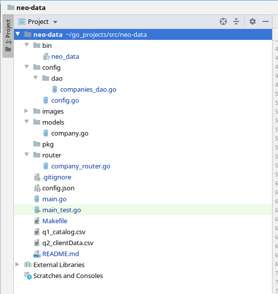

#Neo data - For data integration

This Project is an example for Data Ingration. 
 
The project is an API built on top of Golang which serves endpoints to consume and integrate Companies data information that can be added in two ways
* Importing CSV files
* Caling an Endpoint to create a new record.

## Further explanation

The API make use of MongoDB as NoSql database to store the information.
The data, after entered, is processed and then, if already exist, the information is merged, otherwise, a new record is saved.


## Project Structure


## How to run
1. It is necessary to have set up Golang environment with all the environment variable set. Below there is 
an example of 'go env' from my Linux environment.
<br/>

 

2. It is necessary as well to have the NoSql database MongoDb installed. Could be a MongoDb docker image or even a local instance, but it is necessary to run under the default port 27017.

3. Now, clone the project inside the work folder. For instance, based on the golang environment variables above, the work folder is that $GOPATH/src. After clon, the path should look like this $GOPATH/src/neo-data

4. Now, it is possble to run the project with the command "go run main.go", then if everything is ok, the API will be listening in the http port 3000. In addition to that, you may want to compile and generate an executable, inside the neo-data folder, execute the command "**make all**". This will generate an exe inside $GOPATH/bin

## Project Structure
There are a couple of automated tests that invoke each end point in order to check if it is up and working.
<br/>


<br/>

## Endpoints

* [POST] *Create* - **"/api/company"**  

* Sent Json *
```json
{    
    "name": "TESTCREATE_01",
    "zip": "12345",
    "website": "website"
}
```
> 
* [PUT] - *Update* - **"/api/company/{id}"**

*Sent json*
```json
{
    "id": "5d502bf8cad9901c5d085c04",
    "name": "TESTECREATE_01",
    "zip": "99999",
    "website": "website"
}
``` 
> 

* [DELETE] - *Delete* - **"/api/company/{id}"**
> 
<br/><br/>

* [GET] - *Get company by ID* - **"/api/company/{id}"**
<br/><br/>
> **Request**
> 
<br/><br/>

* [GET] - *Get company by name* - **"/api/company/name/{name}"**
<br/><br/>
> **Request**
> 
<br/><br/>

* [GET] - *Get compay by name and zip code* - **"/api/company/name/{name}/zip/{zip}"**
<br/><br/>
> **Request**
> 
<br/><br/>

* [GET] - *Get all companies data* - **"/api/company"**
<br/><br/>
> **Request / Response**
> 
<br/><br/>

* [POST] - *Import data (batch)* - **"/api/company/batch"**
<br/>
> **Request / Response**
> 
<br/><br/>


